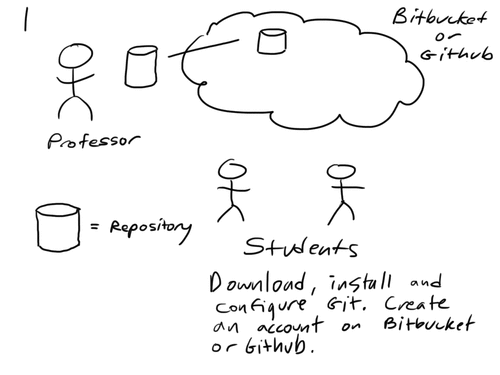

# Git, Bitbucket/Github setup

1. [Download and install Git.](http://git-scm.com)
    (Also, [TortoiseGit on Windows.](http://code.google.com/p/tortoisegit/))

    During installation, always click *Next*, *Continue* or *Finish*, but in the Git install, be sure to first select **Run Git and included Unix tools from the Windows Command Prompt** when it is an option.

2. Configure Git.

	In Windows, open Git Bash: **Start -> All Programs -> Git -> Git Bash**. In Linux/Mac OSX, open **Terminal**.

		git config --global user.name "Joey Lawrance"    # Use your name
		git config --global user.email lawrancej@wit.edu # Use your email

3. Create a [Bitbucket](http://bitbucket.org) or [Github](http://github.com) account. Use your *@wit.edu* email address. 

    **Note:** Bitbucket will automatically give you private repositories necessary for submitting work. If you use Github, [you should first request private repositories](http://github.com/edu); otherwise, you can create a public repository now and make it private later once you get private repository access.

4. [Email me your user name and tell me which service you're using.](mailto:lawrancej@wit.edu)

5. **Optional** Set up your [Gravatar](http://en.gravatar.com/) with your *@wit.edu* email address (that way, people can associate your user name with your face).

6. **Optional** Set up SSH keys (that way, you won't need to type in your password when pushing repositories).

	Create a public/private keypair.

		ssh-keygen -t rsa # Just press enter until it's done

	Copy the public key to the clipboard.

		cat ~/.ssh/id_rsa.pub > /dev/clipboard # On Windows
		cat ~/.ssh/id_rsa.pub | pbcopy # On Mac OS X
		cat ~/.ssh/id_rsa.pub | xclip  # On Linux

	Paste your public SSH key into the key field in Bitbucket or [Github](https://github.com/settings/ssh) (On Bitbucket, navigate to your user -> Manage account -> SSH keys). For the title, use a nickname for your machine.

7. Create a new **private** repository called **Compilers** on [Bitbucket](https://bitbucket.org/repo/create) or [Github](https://github.com/new).

8. Clone the course repository. Please **do not fork.**

		git clone https://bitbucket.org/lawrancej/compilers.git
		 - or - 
		git clone https://github.com/lawrancej/Compilers.git

    When you press enter, you should see something like this:

		Cloning into 'compilers'...
		remote: Counting objects: 12, done.
		remote: Compressing objects: 100% (10/10), done.
		emote: Total 12 (delta 1), reused 0 (delta 0)
		Unpacking objects: 100% (12/12), done.

9. Go into the repository you just cloned.

		cd compilers

10. Connect your local repository to your private repository.

	Copy the HTTPS *.git* repository URL from Bitbucket or Github. (To use SSH repository URLs, set up SSH keys first.)

		git remote -v
		git remote add me url.to.private.repo.goes.here.git
		git push -u me master

11. Reload your private repository on Bitbucket or Github to verify everything pushed over properly.

12. Add me as a collaborator to your private repository (otherwise, I can't see what you submit).

	On Bitbucket, go to your private repository, click the gear icon, and select **Access management**. Enter `lawrancej` under Users and select **Admin**. Click Add.

	On Github, go to your private repository, click **Settings**, click **Collaborators**. Enter `lawrancej`. Click Add.
